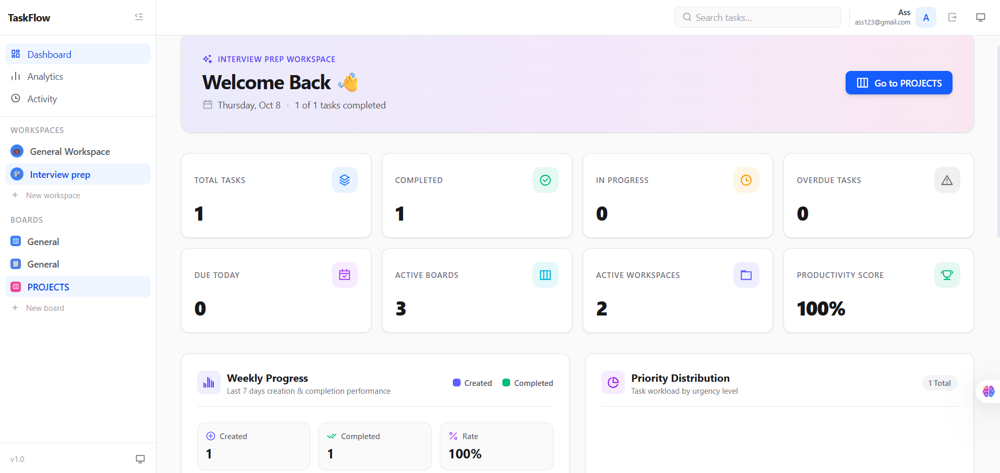
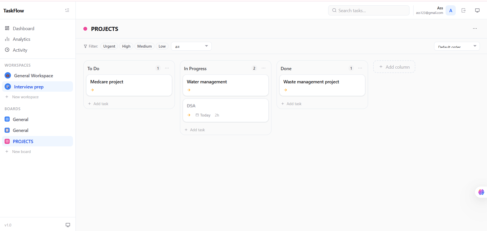
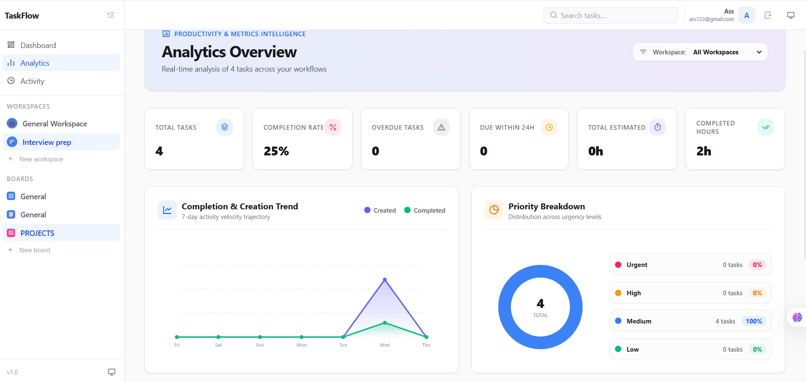
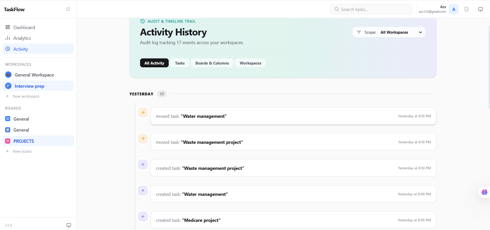

# TaskFlow

### A full-stack task and project management application for organizing workspaces, boards, tasks, and team activities.

TaskFlow is a full-stack web application designed to simplify task and project management. It allows users to create workspaces, organize work using boards and columns, manage tasks, add checklists and comments, and track activities through a centralized dashboard.

The application is built with React and TypeScript on the frontend and ASP.NET Core Web API, Entity Framework Core, and SQL Server on the backend.

---

## 1. Screenshots









---

## 2. Features

- **Workspace Management**: Create, edit, switch, and delete workspaces to keep projects logically separated across teams or domains.
- **Kanban Boards & Columns**: Organize tasks inside customizable boards with drag-and-drop columns (e.g., To Do, In Progress, Done).
- **Comprehensive Task Management**: Create, edit, and view task details with priority tags (Low, Medium, High, Urgent), due dates, rich descriptions, and status indicators.
- **Drag-and-Drop Workflow**: Smoothly drag and drop tasks between columns and reorder them using `@hello-pangea/dnd` with automatic position persistence on the backend.
- **Sub-task Checklists**: Break complex tasks into interactive checklist items with completion progress tracking.
- **Task Comments**: Collaborate on tasks with interactive user comments and history logging.
- **Real-time Activity Logging**: Automatically track events across workspaces and individual tasks (creation, movement, completion, updates).
- **Analytics & Metrics**: View visual breakdown dashboards displaying task distribution, completion rates, and workload statistics.
- **Multi-Tenant User Isolation**: Secure authentication ensuring users only access their own workspaces, boards, and task data.

---

## 3. Tech Stack

### Frontend
- **React** (v19)
- **TypeScript**
- **Vite**
- **Tailwind CSS**
- **Zustand** (State Management)
- **React Router** (Client-side Routing)
- **Framer Motion** (UI Animations & Transitions)
- **@hello-pangea/dnd** (Drag-and-Drop Interface)

### Backend
- **C#**
- **ASP.NET Core 9 Web API**
- **Entity Framework Core 9**
- **REST APIs**
- **JWT Authentication**
- **ASP.NET Core PasswordHasher** (`PasswordHasher<User>`)

### Database
- **Microsoft SQL Server** / **SQL Server Express**
- **Entity Framework Core Migrations**

### Tools & Environment
- **Git** & **GitHub**
- **Docker**
- **Swagger / OpenAPI**
- **Postman**
- **Visual Studio Code**

---

## 4. Architecture

TaskFlow adopts a modern decoupled Client-Server architecture:

```
┌─────────────────────────────────────────────────────────┐
│                      Client Layer                       │
│      React 19 + TypeScript + Zustand + Tailwind CSS    │
└────────────────────────────┬────────────────────────────┘
                             │  HTTP / REST (JWT Bearer)
                             ▼
┌─────────────────────────────────────────────────────────┐
│                      Backend API                        │
│          ASP.NET Core 9 Web API Controllers            │
├─────────────────────────────────────────────────────────┤
│                     Service Layer                       │
│    Auth, Workspaces, Boards, Columns, Tasks, Activity   │
└────────────────────────────┬────────────────────────────┘
                             │  Entity Framework Core 9
                             ▼
┌─────────────────────────────────────────────────────────┐
│                     Database Layer                      │
│            Microsoft SQL Server / SQL Express           │
└────────────────────────────┬────────────────────────────┘
```

- **Frontend**: A fast SPA built with Vite, React, and TypeScript. Uses Zustand for modular global state, Axios for API communication, and Framer Motion for smooth micro-interactions.
- **Backend API**: Structured ASP.NET Core Web API with separation of concerns across Controllers, DTOs, Service interfaces/implementations, and Data entities.
- **Database**: Relational schema managed via EF Core Code-First migrations with foreign keys, indexes, and cascades.

---

## 5. Authentication & Security

TaskFlow implements stateless token-based authentication and secure data isolation:

- **JWT Bearer Authentication**: Secure JSON Web Tokens signed with HMAC-SHA256 containing user claims (`sub`, `email`, `name`).
- **Password Hashing**: Passwords are never stored in plain text; they are hashed using ASP.NET Core `PasswordHasher<User>` utilizing PBKDF2 with SHA-256 and automatic salting.
- **Protected Endpoints**: Controller routes are decorated with `[Authorize]` attributes to reject unauthenticated requests.
- **User Claim Extraction**: User identity is dynamically resolved from token claims on every request.
- **Multi-Tenant Data Isolation**: Database queries enforce user scoping (`UserId`), preventing cross-tenant data access.
- **DTO Security**: Password hashes and sensitive internal metadata are excluded from all API response models.

### Authentication Flow

```
User Login
    ↓
ASP.NET Core API
    ↓
Credential Validation
    ↓
JWT Token Generated
    ↓
Frontend
    ↓
Token Included in API Requests
    ↓
Protected API Endpoints
```

### JWT Configuration Example (`appsettings.Development.json`)

```json
{
  "Jwt": {
    "Key": "your-development-secret-key"
  }
}
```

---

## 6. Database

The database schema is managed via Entity Framework Core Code-First Migrations and consists of the following core entities:

- **Users**: User credentials, email, full name, and registration timestamps.
- **Workspaces**: Main container for boards and activities, linked to a specific owner (`UserId`).
- **Boards**: Kanban boards scoped to a workspace (`WorkspaceId`).
- **Columns**: Workflow stages (e.g., To Do, In Progress, Done) ordered by position index (`BoardId`).
- **Tasks**: Work items containing title, description, priority, due date, status, column position, and relationships.
- **Checklist Items**: Sub-task items belonging to a task (`TaskId`) with completion status (`IsCompleted`).
- **Comments**: User discussions and feedback attached to tasks (`TaskId`, `UserId`).
- **Activities**: Historical audit trail logging user actions per workspace and task.
- **`__EFMigrationsHistory`**: System table tracking applied EF Core database migrations.

---

## 7. Project Structure

```
Task-flow-project/
├── .git/
├── backend/
│   └── TaskFlow.API/
│       ├── Controllers/       # API endpoints (Auth, Workspaces, Boards, Tasks, etc.)
│       ├── Data/              # DbContext & EF Core configuration
│       ├── DTOs/              # Request & response data transfer objects
│       ├── Entities/          # Database domain entities
│       ├── Interfaces/        # Service interface contracts
│       ├── Migrations/        # EF Core Code-First migrations
│       ├── Services/          # Business logic implementations
│       ├── Program.cs         # Dependency injection & middleware pipeline
│       └── appsettings.json   # Base application settings
├── public/                    # Static public assets
├── screenshots/               # Application demonstration images
│   ├── dashboard.png
│   ├── task-board.png
│   ├── analytics.png
│   └── activity.png
├── src/
│   ├── assets/                # Images & icons
│   ├── components/            # UI components (Kanban, Modals, Layout, Navigation)
│   ├── context/               # React context providers
│   ├── pages/                 # Main page views (Dashboard, Board, Analytics, Activity)
│   ├── services/              # API HTTP client services
│   ├── store/                 # Zustand global state stores
│   ├── types/                 # TypeScript interfaces and types
│   ├── App.tsx                # Main Application component & routing
│   └── main.tsx               # Application entry point
├── .gitignore                 # Version control ignore definitions
├── eslint.config.js           # ESLint configuration
├── package.json               # Frontend dependencies & scripts
├── tailwind.config.ts         # Tailwind CSS styling configuration
├── tsconfig.json              # TypeScript root configuration
└── README.md                  # Repository documentation
```

---

## 8. How to Run

### Prerequisites
- **.NET 9 SDK**: Ensure .NET 9 SDK is installed (`dotnet --version`).
- **Node.js**: v18.x or higher (`node -v`).
- **SQL Server**: Microsoft SQL Server / SQL Server Express running locally.

### 1. Database & Backend Setup

1. Navigate to the backend directory:
   ```bash
   cd backend/TaskFlow.API
   ```
2. Configure local development settings in `appsettings.Development.json`:
   ```json
   {
     "Jwt": {
       "Key": "TaskFlowSecretSigningKey_MustBeAtLeast32BytesLong_2026_SecureKey"
     }
   }
   ```
3. Apply database migrations to create the SQL Server database (`TaskFlowDb`):
   ```bash
   dotnet ef database update
   ```
4. Run the ASP.NET Core API server:
   ```bash
   dotnet run
   ```
   The API server will start on `http://localhost:5000` (or `https://localhost:5001`). Swagger UI will be available at `http://localhost:5000/swagger`.

### 2. Frontend Setup

1. Open a new terminal in the repository root directory:
   ```bash
   cd Task-flow-project
   ```
2. Install dependencies:
   ```bash
   npm install
   ```
3. Start the Vite development server:
   ```bash
   npm run dev
   ```
4. Open your browser and navigate to `http://localhost:5173`.

---

## 9. API Overview

All API endpoints (except `/api/auth/*`) require a valid JWT Bearer Token passed in the `Authorization: Bearer <token>` HTTP header.

| Category | HTTP Method | Endpoint | Description |
| :--- | :--- | :--- | :--- |
| **Auth** | `POST` | `/api/auth/register` | Register a new user account |
| **Auth** | `POST` | `/api/auth/login` | Authenticate user and receive JWT token |
| **Workspaces** | `GET` | `/api/workspaces` | Get all workspaces for authenticated user |
| **Workspaces** | `GET` | `/api/workspaces/{id}` | Get workspace details by ID |
| **Workspaces** | `POST` | `/api/workspaces` | Create a new workspace |
| **Workspaces** | `PUT` | `/api/workspaces/{id}` | Update existing workspace |
| **Workspaces** | `DELETE` | `/api/workspaces/{id}` | Delete workspace |
| **Boards** | `GET` | `/api/boards/workspace/{workspaceId}` | Get boards in a workspace |
| **Boards** | `GET` | `/api/boards/{id}` | Get board details by ID |
| **Boards** | `POST` | `/api/boards` | Create a new board |
| **Boards** | `PUT` | `/api/boards/{id}` | Update board |
| **Boards** | `DELETE` | `/api/boards/{id}` | Delete board |
| **Columns** | `GET` | `/api/columns/board/{boardId}` | Get columns for a board |
| **Columns** | `POST` | `/api/columns` | Create a new column |
| **Columns** | `PUT` | `/api/columns/{id}` | Update column title/position |
| **Columns** | `DELETE` | `/api/columns/{id}` | Delete column |
| **Columns** | `PUT` | `/api/columns/reorder` | Reorder multiple columns |
| **Tasks** | `GET` | `/api/tasks/board/{boardId}` | Get all tasks for a board |
| **Tasks** | `GET` | `/api/tasks/{id}` | Get task details |
| **Tasks** | `POST` | `/api/tasks` | Create a new task |
| **Tasks** | `PUT` | `/api/tasks/{id}` | Update task properties |
| **Tasks** | `DELETE` | `/api/tasks/{id}` | Delete task |
| **Tasks** | `PUT` | `/api/tasks/{id}/move` | Move task to column/position |
| **Checklist** | `POST` | `/api/tasks/{taskId}/checklist` | Add checklist item to task |
| **Checklist** | `PUT` | `/api/tasks/{taskId}/checklist/{itemId}` | Update/toggle checklist item |
| **Checklist** | `DELETE` | `/api/tasks/{taskId}/checklist/{itemId}` | Delete checklist item |
| **Comments** | `POST` | `/api/tasks/{taskId}/comments` | Add comment to task |
| **Comments** | `DELETE` | `/api/tasks/{taskId}/comments/{commentId}` | Delete comment |
| **Activities** | `GET` | `/api/activities` | Get user activity feed |
| **Activities** | `GET` | `/api/activities/workspace/{workspaceId}` | Get workspace activity log |
| **Activities** | `GET` | `/api/activities/task/{taskId}` | Get task activity log |

---

## 10. Testing & Code Quality

The application has undergone end-to-end operational and code quality verification:

- **Authentication & Security**: Verified registration, credential validation, JWT token issuance, and handling of invalid credentials or missing tokens.
- **Workspace & Board CRUD**: Tested workspace creation, editing, deletion, and board mapping.
- **Task & Column Workflow**: Tested column creation, reordering, task creation, editing, and deletion.
- **Drag-and-Drop Interaction**: Tested smooth task dragging between columns with backend position updates.
- **Checklists & Comments**: Tested adding checklist items, toggling completion status, and attaching user comments.
- **Activity Feed**: Verified automatic event creation on task movements, status changes, and edits.
- **Database Integrity**: Verified SQL Server persistence across server restarts and strict user-level data isolation.
- **Frontend Code Quality**:
  - `npm run lint` executed cleanly with 0 ESLint errors/warnings.
  - `npx tsc --noEmit` executed cleanly with 0 TypeScript compilation errors.
  - `npm run build` completed successfully, generating optimized production bundles.
- **Backend Code Quality**:
  - `dotnet build` compiled cleanly with 0 warnings and 0 errors.

---

## 11. What I Learned

- **Full-Stack Architecture**: Designing and integrating a responsive React SPA with a strong, statically-typed ASP.NET Core 9 Web API.
- **State Management & Persistence**: Managing complex Kanban board drag-and-drop state efficiently using Zustand and synchronizing positional changes to SQL Server in real time.
- **Security & Authorization**: Implementing robust JWT authentication, claim-based authorization, PBKDF2 password hashing, and multi-tenant data scoping.
- **Code-First ORM Practices**: Designing relational database schemas using Entity Framework Core Code-First migrations with proper indexing and relationship cascades.

---

## 12. Future Improvements

- **Real-Time Collaboration**: Integrate ASP.NET Core SignalR for real-time board updates across multi-user sessions.
- **Role-Based Access Control (RBAC)**: Add workspace member roles (Owner, Admin, Member, Viewer) with granular permissions.
- **File Attachments**: Enable cloud storage integration (AWS S3 / Azure Blob Storage) for attaching documents and images to tasks.
- **Integrations**: Add Webhooks and email notification triggers for deadline reminders and task assignments.

---

## 13. Author

**TaskFlow Development Team**
- Full-Stack Developer / Software Engineer
